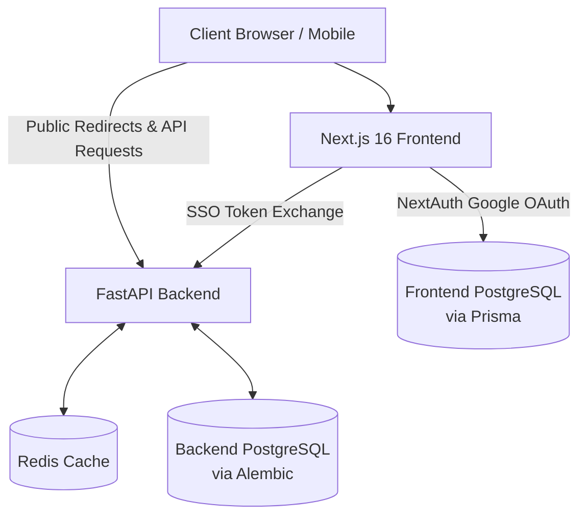

# NikkaLink

A production-ready, high-performance URL shortening and link-management platform featuring instant redirection, rich analytics, custom aliases, and secure authentication.

[Live Demo](https://nikkalink.vercel.app)

## Overview

NikkaLink is an enterprise-grade URL management platform designed to transform long, opaque links into branded, trackable short URLs. Built for modern teams, developers, and marketing professionals, it distinguishes itself from monolithic alternatives through a strictly decoupled Next.js micro-frontend and a highly scalable, asynchronous FastAPI backend. 

With sub-millisecond cache-first redirects, privacy-conscious click analytics, and secure hybrid authentication, NikkaLink provides both a beautiful user experience and robust engineering underneath.

## Key Features

- **Instant URL Shortening**: Cryptographically generated non-sequential short codes.
- **Custom Aliases**: Create branded, memorable short links.
- **Authenticated Link Management**: Manage and track URLs via a user dashboard.
- **Rich Click Analytics**: Track total clicks, unique visitors, browsers, devices, OS, referrers, and time-series data.
- **QR Code Generation**: Instantly generate downloadable PNG QR codes for any link.
- **High-Performance Caching**: Redis-backed cache-first redirects.
- **Rate Limiting**: Protects against abuse for both anonymous and authenticated endpoints.
- **Google OAuth Integration**: Secure session management via NextAuth.
- **PWA Ready**: Progressive Web App installability and offline support features.
- **Responsive UI**: Premium interface built with Tailwind CSS v4 and shadcn/ui.

## Tech Stack

| Layer | Technologies |
|---|---|
| Frontend | Next.js 16 (App Router), React 19, TypeScript |
| Backend | Python 3.12, FastAPI, Uvicorn |
| Database | PostgreSQL (Dual Architecture) |
| ORM / Migrations | Prisma (Frontend) / SQLAlchemy 2.0 & Alembic (Backend) |
| Authentication | NextAuth.js (Google OAuth) / PyJWT |
| Caching & Rate Limiting| Redis (Upstash supported) |
| UI | Tailwind CSS v4, shadcn/ui, Recharts, Framer Motion |
| Infrastructure | Docker, Docker Compose |
| Deployment | Vercel (Frontend), Render (Backend), Neon (PostgreSQL) |

## System Architecture

NikkaLink utilizes a explicitly decoupled **Client-Server Micro-architecture** to separate concerns: UI rendering is handled by Next.js, while heavy I/O operations (like URL redirects and analytics recording) are handled by a persistent FastAPI server.

The system employs a unique **Dual PostgreSQL Architecture** to prevent migration conflicts between Node/Prisma and Python/Alembic ecosystems.



- **Frontend/Auth Side**: The Next.js frontend manages Google OAuth sessions, users, and the UI using Prisma and a dedicated frontend PostgreSQL database.
- **Backend/Core Side**: The FastAPI service manages URL shortening, core routing, and analytics using SQLAlchemy/Alembic and a dedicated backend PostgreSQL database.
- **Authentication Bridge**: A secure Server-to-Server (SSO) token exchange bridges the two databases, validating NextAuth sessions and issuing native FastAPI JWTs.

## How NikkaLink Works

### URL Creation

1. A user submits a long URL (and optional custom alias).
2. The FastAPI backend generates a cryptographically secure 7-character Base62 string.
3. The database is checked to guarantee collision-free uniqueness.
4. The short URL is saved to PostgreSQL and immediately cached in Redis for instantaneous future lookups.

### Redirect

1. A visitor accesses a short URL (e.g., `nikkalink.com/aB3x9Z`).
2. FastAPI queries the **Redis cache**.
3. **Cache Hit**: Retrieves the original URL instantly (O(1)).
4. **Cache Miss**: Queries PostgreSQL, caches the result in Redis, and retrieves the URL.
5. The analytics engine triggers an asynchronous event to record the click.
6. A `302 Found` redirect is returned in milliseconds.

### Authentication

NikkaLink uses a Hybrid Authentication Flow:
NextAuth.js handles the OAuth dance with Google on the frontend. Once verified, a secure internal API route negotiates with the FastAPI backend using an SSO secret. The backend validates the identity, ensures a mirrored user record exists, and issues a PyJWT access/refresh token. Future API requests are authenticated statelessly.

### Analytics

Click analytics are processed asynchronously via an internal event bus (`LINK_VISITED`). This ensures heavy data aggregation and parsing (e.g., extracting device, OS, and browser from the User-Agent) never block the user's redirect latency. 

## URL Shortening Algorithm

NikkaLink does not use sequential auto-incrementing IDs for its links. Sequential IDs are predictable, allowing malicious actors to easily enumerate, scrape, and discover all links in the system. 

Instead, it utilizes cryptographically secure randomness (`secrets.choice` in Python) to generate a **7-character Base62** (`a-zA-Z0-9`) string. This provides ~3.5 trillion unique combinations, making enumeration attacks practically impossible while keeping links highly concise.

## Database Architecture

The system safely isolates identity management from core routing logic via a dual-database design:

### Frontend/Auth Database
Managed by **Prisma**. Contains standard NextAuth schema entities: Users, Accounts, and Sessions.

### Backend/Core Database
Managed by **Alembic** and SQLAlchemy. Contains:
- `users`: Synchronized identities from the frontend.
- `urls`: Indexed by `short_code` for rapid lookups, with soft-deletion support (`deleted_at`).
- `clicks`: Highly structured click records linked to URLs for analytics aggregation.

## Redis and Performance

Redis is a fundamental component of NikkaLink's performance strategy:
- **Redirect Caching**: Redis-backed cache-first URL resolution drastically reduces repeated database lookups for frequently accessed links.
- **Cache Invalidation**: Modifying or soft-deleting a URL actively removes the associated key from the cache.
- **Rate Limiting**: Sliding-window rate limiting restricts anonymous requests (30/min) and authenticated requests (120/min) to prevent abuse.

## Analytics

NikkaLink extracts deep insights from every redirect:
- Total and Unique Clicks
- Browser, Device, and Operating System categorization
- Referrer and Traffic Source tracking
- Time-series aggregation for dashboard visualizations

**Privacy Note**: Raw IP addresses are not persisted in the database. They are immediately hashed via SHA-256 for privacy-conscious unique visitor tracking.

## QR Codes

Server-side QR codes are generated entirely on-demand in memory using `qrcode[pil]`. The PNG image is returned directly as a byte stream (`Content-Disposition: inline`), avoiding the complexity and cost of storing volatile image assets in S3 or the database.

## API Overview

NikkaLink features a fully documented FastAPI REST API. Key endpoints include:

| Method | Endpoint | Purpose | Auth |
|---|---|---|---|
| `GET` | `/{short_code}` | Public Redirect (302) | No |
| `POST` | `/api/v1/urls` | Create short URL | Optional |
| `GET` | `/api/v1/urls` | List user URLs | Yes |
| `GET` | `/api/v1/urls/{code}` | Get URL details | Optional (if owner) |
| `GET` | `/api/v1/urls/{code}/qr`| Download QR Code PNG | No |
| `GET` | `/api/v1/analytics/{code}`| Get analytics summary | Optional (if owner) |
| `POST` | `/api/v1/auth/sso` | Sync NextAuth to JWT | Secret Header |

## Project Structure

```text
├── frontend/               # Next.js 16 App Router UI
│   ├── app/                # Pages, Layouts, NextAuth API routes
│   ├── components/         # React, Tailwind, shadcn/ui components
│   ├── lib/                # React Query hooks, fetch utilities
│   └── prisma/             # Frontend DB schema
├── app/                    # FastAPI Backend Core
│   ├── api/v1/             # API Routers (URLs, Auth, Analytics)
│   ├── core/               # Redis Client, Config, Middleware
│   ├── db/                 # SQLAlchemy Async Session setup
│   ├── events/             # Async Event Bus (LINK_VISITED)
│   ├── models/             # SQLAlchemy ORM definitions
│   ├── services/           # Business logic (URL, Analytics)
│   └── utils/              # Base62 generation, QR code logic
├── alembic/                # Backend DB Migrations
├── docker-compose.yml      # Local orchestration
└── pyproject.toml          # Backend dependencies
```

## Security

- **Authentication**: JWT authentication with refresh token rotation and bcrypt hashing. Google OAuth prevents custom credential management.
- **Authorization**: Explicit ownership checks prevent IDOR attacks (e.g., users cannot edit URLs they do not own).
- **Protection**: Redis-backed rate limiting and parameterized ORM queries (Prisma/SQLAlchemy) to prevent SQL injection.
- **Privacy**: IPs are cryptographically hashed before analytics storage.
- **Anti-Enumeration**: Random Base62 generation over predictable auto-increment IDs.

## Environment Variables

### Frontend Environment Variables (`frontend/.env.local`)
| Variable | Required | Purpose |
|---|---|---|
| `DATABASE_URL` | Yes | Frontend-only PostgreSQL connection string (Prisma). |
| `NEXTAUTH_SECRET` | Yes | NextAuth session signing secret. |
| `NEXTAUTH_URL` | Yes | Base URL for NextAuth callbacks. |
| `AUTH_GOOGLE_ID` | Yes | Google OAuth Client ID. |
| `AUTH_GOOGLE_SECRET` | Yes | Google OAuth Client Secret. |
| `FRONTEND_SSO_SECRET` | Yes | Shared secret for backend JWT exchange. |
| `NEXT_PUBLIC_API_URL` | Yes | FastAPI backend URL. |

### Backend Environment Variables (`.env`)
| Variable | Required | Purpose |
|---|---|---|
| `ENVIRONMENT` | Yes | Set to `production` or `development`. |
| `DATABASE_URL` | Yes | Backend-only PostgreSQL connection string (Asyncpg). |
| `JWT_SECRET_KEY` | Yes | Secret for signing backend JWTs. |
| `FRONTEND_SSO_SECRET` | Yes | Shared secret for frontend JWT exchange. |
| `BASE_URL` | Yes | Public URL of the FastAPI service. |
| `PUBLIC_APP_URL` | Yes | Public URL of the Next.js frontend. |
| `CORS_ORIGINS` | Yes | Allowed frontend origins. |
| `UPSTASH_REDIS_REST_URL` | No | Upstash REST endpoint (optional). |

## Getting Started

### Prerequisites
- Node.js 20+
- Python 3.12+
- Docker & Docker Compose (for local services)

### Setup & Run Locally

1. **Clone the repository:**
   ```bash
   git clone https://github.com/Ishaan6286/NikkaLink.git
   cd NikkaLink
   ```

2. **Run via Docker Compose (Simplest Method):**
   This spins up the Next.js frontend, FastAPI backend, two PostgreSQL instances, and Redis.
   ```bash
   cp .env.example .env
   cp frontend/.env.local.example frontend/.env.local
   # Update environment variables with required secrets
   docker-compose up -d --build
   ```

3. **Run Database Migrations (Backend):**
   ```bash
   docker-compose exec api alembic upgrade head
   ```

The application will be accessible at `http://localhost:3000` and the API documentation at `http://localhost:8000/docs`.

## Deployment

NikkaLink is designed to be deployed across specialized, decoupled infrastructure:

1. **Frontend:** Vercel (Next.js 16 Serverless/Edge rendering).
2. **Backend:** Render, Railway, or AWS (Persistent FastAPI container).
3. **Databases:** Neon or Supabase (Two separate PostgreSQL databases or branches).
4. **Cache:** Upstash (Serverless Redis).

## Known Limitations

- **Redis Dependency**: The system currently relies heavily on Redis for rate limiting and cache-first lookups. Complete Redis failure may disrupt redirect flows.
- **Analytics Scalability**: For extremely viral links (1B+ clicks/month), the `clicks` PostgreSQL table may bottleneck. Time-based partitioning or a migration to ClickHouse would be required at hyperscale.
- **Malicious Links**: NikkaLink does not currently implement active malicious URL scanning (e.g., Google Safe Browsing API) at the point of URL creation.

## Additional Documentation

For deeper technical context, refer to the project's internal knowledge base:
- [`NIKKALINK_MASTER_INTERVIEW_GUIDE.md`](./NIKKALINK_MASTER_INTERVIEW_GUIDE.md): Deep technical reference and product overview.
- [`NIKKALINK_ARCHITECTURE_AND_FLOWS.md`](./NIKKALINK_ARCHITECTURE_AND_FLOWS.md): Detailed architecture breakdown and end-to-end flows.
- [`NIKKALINK_INTERVIEW_QA.md`](./NIKKALINK_INTERVIEW_QA.md): Engineering decisions, system design tradeoffs, and scalability considerations.
- [`NIKKALINK_3_HOUR_STUDY_DATA.md`](./NIKKALINK_3_HOUR_STUDY_DATA.md): Condensed technical study sheet.

## License

MIT License.

---
*Created by NikkaLink URL Shortener Team.*
